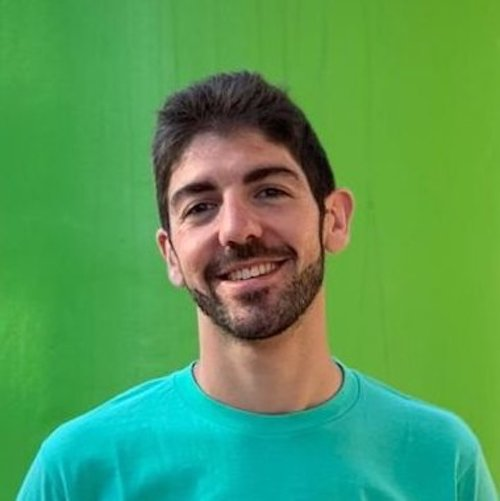
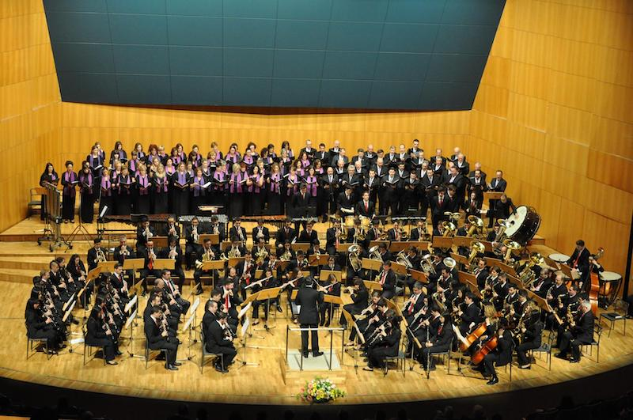

	

I'm an Android developer 👨‍💻 currently working as a Developer Relations engineer at Google.

### What I do

As a *Developer Relations (DevRel)* engineer, it's my focus to help improving the Android developer experience. I'm currently focusing on **Kotlin & Coroutines, Jetpack Compose, general app architecture, and dependency injection** (including Dagger and Hilt).

My role can be clearly divided into two main tasks: 

* **Feedback to other teams**. DevRel is the *0th customer* for libraries and framework SDK updates. We're the first ones trying out what's coming next in Android development and deliver feedback accordingly. **Always with the Android community in mind**, I pay attention to API usability and how certain features could be misused, discuss trade offs and alternatives to different solutions, file bugs, etc.

* **Outreach and guidance**. Apart from the content you can find in this website, I contribute with documentation to [developers.android.com](https://developers.android.com), [codelabs](https://codelabs.developers.google.com/), and [code samples](https://github.com/android). I love getting involved with the community by going and speaking in conferences, writing articles, and helping others as much as I can.

### Background

I started playing the trumpet 🎺 since I was 7 years old. During my childhood and adolescence, for more than 10 years, I studied music and was part of my hometown concert band: Las Musas de Guadalupe. There is where I learnt key concepts that highly influenced how I am today:

* Team spirit! You're part of a band, you cannot do everything yourself. Rely on your teammates and enjoy doing what you love together.

* Being on stage and playing solos every other month helps with stage fright. My current public speaking skills benefits from this.

* Appreciate the beauty of art - music specially. Everything is art! The code you write, your designs, your apps... everything! I tend to do things in the most beatiful way I can, keeping everything within a good harmony and balance.

	
	<small>Playing with Las Musas de Guadalupe</small>

Fast forward a few years, I graduated in Computer Science at the [University of Murcia](https://en.wikipedia.org/wiki/University_of_Murcia) (Spain) and moved to Nottingham (UK) to work at Capital One UK as an Android developer. Few years later, I transferred to the US to work at Capital One in McLean, Virginia; close to Washington D.C.

	
	<small>Last day in Nottingham - Robin Hood's land</small>

During that time at Capital One, I got the chance of architecting an app from scratch and adopting the latest technologies while always having the customer in mind. Scalability, testing, and accessibility also played an important role.

But not only Android! iOS, multiplatform development and designing are areas I explored and worked on in my free time, using tools such as XCode, Photoshop, Illustrator, or Sketch.

	
	<small>Paying a visit to the Android lawn statues in Mountain View</small>

### Contact

Feel free to reach out to me on [Twitter](https://twitter.com/manuelvicnt) where I'll happily chat with you or answer any questions you may have.

Thanks all!