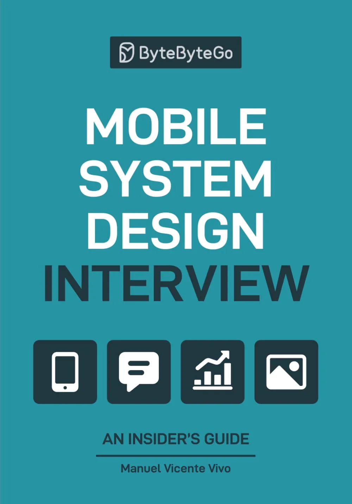

Unlike general system design books, this is the first comprehensive guide written specifically for mobile platforms.

  

    

      
    

    

      <h1>Nail your next interview!</h1>
      

        Whether you're facing challenges like <strong>"Design YouTube"</strong> or <strong>"Build a chat app"</strong>, you'll learn a proven framework that works for both Android and iOS.
      

      

        <a href="https://geni.us/bbg-msd" class="button">✨ Buy on Amazon 🛒</a>
      

    

  

  <section class="who-should-read" style="margin-bottom: 60px; padding: 40px; background: var(--brand-color-light); border-radius: 12px;">
    <h2 style="margin-top: 0; border-bottom-color: var(--brand-color);">Who should read this book?</h2>
    
This book is built for YOU — whether you're:

    <ul style="line-height: 2; font-size: 1.1em; list-style: none; padding: 0;">
      <li style="margin-bottom: 15px;">📱 <strong>Mobile Engineer:</strong> Gearing up for interviews at top tech companies.</li>
      <li style="margin-bottom: 15px;">🏗️ <strong>Tech Lead:</strong> Sharpening your architecture skills and guiding your team.</li>
      <li style="margin-bottom: 0;">🚀 <strong>Engineering Leader:</strong> Curious about mobile internals and best practices.</li>
    </ul>
    
It's perfect for both Android and iOS engineers who want to master the art of designing scalable, performant mobile systems.

  </section>

  <section class="whats-inside" style="margin-bottom: 60px;">
    <h2>What's inside</h2>
    
The book covers 10 comprehensive chapters designed to take you from basics to advanced mobile architecture.

    
    

      

1
 Introduction

      

2
 A Framework for MSD Interviews

      

3
 Design a News Feed App

      

4
 Design a Chat App

      

5
 Design a Stock Trading App

      

6
 Design a Pagination Library

      

7
 Design a Hotel Reservation App

      

8
 Design the Google Drive App

      

9
 Design the YouTube app

      

10
 MSD Building Blocks

      

★
 Quick Reference Cheat Sheet for MSD Interview

    

  </section>

  <section class="what-you-learn" style="margin-bottom: 60px; padding: 40px; background: var(--brand-color-light); border-radius: 12px;">
    <h2 style="border-bottom-color: var(--brand-color); margin-top: 0px;">What you'll learn</h2>
    <ul style="line-height: 2; font-size: 1.1em; list-style: none; padding: 0; margin-bottom: 0px;">
      <li style="margin-bottom: 15px;">🏆 <strong>A proven 5-step playbook:</strong> Turns any "Design X" prompt into a structured answer that speaks the interviewer's language.</li>
      <li style="margin-bottom: 15px;">📝 <strong>7 fully solved questions:</strong> Every decision, diagram, and pitfall exposed for real-world apps.</li>
      <li style="margin-bottom: 15px;">🔢 <strong>175 topics:</strong> Covering the full spectrum of mobile system design principles.</li>
      <li style="margin-bottom: 0;">🔧 <strong>Practical to the core:</strong> Real-world case studies, reusable checklists, and trade-off cheat sheets.</li>
    </ul>
  </section>

  

    <h3>Still unsure?</h3>
    <a href="https://bytebytego.com/courses/mobile-system-design-interview/introduction" class="button">Read the first chapters for FREE!</a>
  

  <section class="use-cases" style="margin-bottom: 60px;">
    <h2>What readers say</h2>

    

      <h3 style="margin-bottom: 15px; color: var(--brand-color);">Walk into the interview with a playbook and leave with a 'yes'</h3>
      

        
"...and it worked... I passed my interviews!"

        

          I bought this book just a week before my system design interview and crammed through it, and it worked! The explanations were clear, the examples practical, and it gave me the exact framework I needed to approach the questions confidently. I'm happy to say I passed my interviews. Huge thanks to the author for putting together such a helpful resource!
          
Amir - Amazon

        

      

    

    

      <h3 style="margin-bottom: 15px; color: var(--brand-color);">Make 'it depends' sound like clarity, not hesitation</h3>
      

        
"It's about learning to think like a senior engineer."

        

          In a world where everyone's chasing quick AI-powered productivity hacks, we often overlook one of our greatest abilities, the power to deeply learn and rethink how we build things. 📚 Lately, I've been diving into "Mobile System Design Interview" by Manuel Vicente Vivo, and I'm halfway through, already impressed by how it's reshaping my approach to mobile architecture and system-level thinking.  
          This book isn't just about interview prep. It's about learning to think like a senior engineer. If you're preparing for senior roles, architecture discussions, or just want to level up your fundamentals, then this is a must-read. Let's not just automate more. Let's understand more. 🔍
          
Cawin - LinkedIn

        

      

    

    

      <h3 style="margin-bottom: 15px; color: var(--brand-color);">Lead the design discussion. Align iOS + Android. Ship with confidence.</h3>
      

        
"This dual-platform approach makes it an invaluable resource for any mobile engineer"

        

          A major strength of this book is its comprehensive coverage of both Android and iOS. It doesn't favor one platform over the other but instead highlights common design patterns and principles that are applicable across both ecosystems, while also addressing platform-specific implementations and considerations where necessary. This dual-platform approach makes it an invaluable resource for any mobile engineer, regardless of their primary expertise.
          
Thomas - Amazon

        

      

    

    

      <h3 style="margin-bottom: 15px; color: var(--brand-color);">Raise the bar for mobile architecture across your team</h3>
      

        
"...walks you through multiple solution paths... explains trade-offs..."

        

          A while ago, I started diving deep into System Design and surprisingly, I couldn't find resources that truly speak to Mobile Developers. So I decided to order this book from the US and a few days later, it arrived. And honestly, it turned out to be one of the best books I've read in a long time. The book doesn't just present concepts, it walks you through multiple solution paths, explains trade-offs, and helps you understand why a certain architecture is the best fit for a particular problem. After reading it, the way you look at mobile app development will completely change.
          
Youseff - LinkedIn

        

      

    

    

      <h3 style="margin-bottom: 15px; color: var(--brand-color);">Set a mobile architecture standard your org can scale</h3>
      

        
"This is a must-read for anyone serious about mobile app development"

        

          I didn't buy this book for interview preparation, but rather to see whether I had been doing my projects correctly over the past decade. It has cleared up many doubts I've had through the years. This is a must-read for anyone serious about mobile app development—particularly in today's AI-driven era, where many assume they can code anything, yet only apps with clear and maintainable architectures will truly shine.
          
Hong-Yi - Amazon

        

      

    

  </section>

  <section class="authors" style="margin-bottom: 0px;">
    <h2>The Author</h2>
    

      
      

        <h3>Manuel Vivo</h3>
        
<strong>Staff Mobile Architect</strong>

        
Manuel Vicente Vivo is a Staff Mobile Architect and seasoned Android engineer with experience at leading companies including Capital One, Google, and Bumble Inc. Beyond his technical expertise, Manuel is a dedicated mentor, accomplished public speaker, and prolific writer whose work has reached and inspired millions around the world.

      

    

  </section>

  

    <h3>Do you want to tackle complex mobile design with clarity and confidence?</h3>
    <a href="https://geni.us/bbg-msd" class="button">Grab your copy now!</a>
  

  <section class="faq-section" style="margin-bottom: 0px; margin-top: 60px">
    <h2>Frequently Asked Questions</h2>
    
    

      

        <h4 class="faq-question">📱 Is the book available in digital format (eBook, PDF, Kindle)?</h4>
        

          
The book is currently only available in <strong>paperback format</strong>. We're working on a digital version, but it's not available yet. Stay tuned for updates!

        

      

      

        <h4 class="faq-question">🌍 Can I buy the book anywhere besides Amazon?</h4>
        

          
The book is available through <a href="https://geni.us/bbg-msd" target="_blank">Amazon</a> with international shipping to most countries.

          
If you're in <strong>India</strong> and cannot get it through Amazon, you can order it directly from our Indian publisher: <a href="https://www.shroffpublishers.com/books/9789368082255/" target="_blank">Shroff Publishers</a>.

        

      

      

        <h4 class="faq-question">🆓 Can I preview the book before buying?</h4>
        

          
Yes! You can <a href="https://bytebytego.com/courses/mobile-system-design-interview/introduction" target="_blank">read the first chapters for FREE</a> to get a feel for the content and approach.

        

      

      

        <h4 class="faq-question">🤔 Is this book only for interview preparation?</h4>
        

          
While the book is excellent for interview prep, it's also valuable for:

          <ul>
            <li>Learning to think like a senior engineer</li>
            <li>Understanding mobile architecture best practices</li>
            <li>Making better architectural decisions in your daily work</li>
            <li>Leading architecture discussions with your team</li>
          </ul>
        

      

      

        <h4 class="faq-question">📖 What are the book details?</h4>
        

          
<strong>ISBN:</strong> 1736049151 / 978-1736049150

          
<strong>Publisher:</strong> ByteByteGo

          
<strong>Publish date:</strong> Jun 06, 2025

          
<strong>Pages:</strong> 293

        

      

    

  </section>

  

